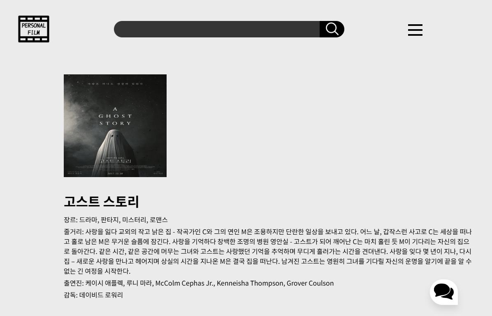
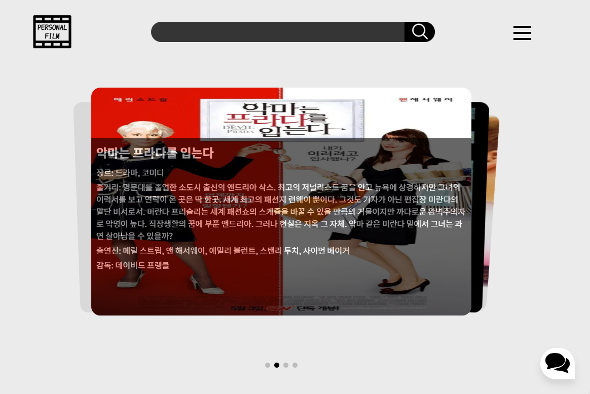
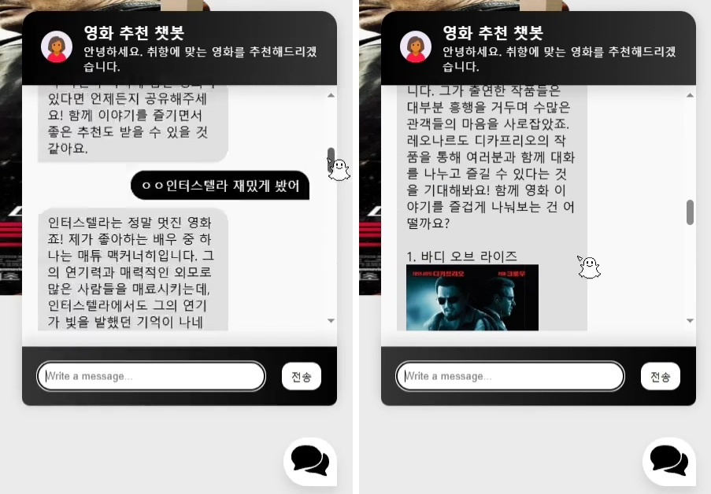
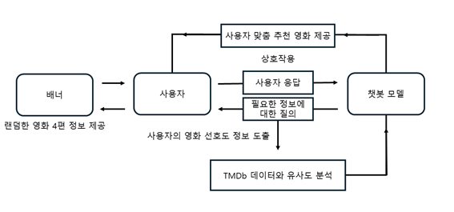

# 🎞 퍼스널필름
사용자 입력에 기반한 영화 추천 서비스   

## 1. 프로젝트 개요
챗봇을 통해 개인 맞춤형 영화를 추천하는 웹 애플리케이션입니다.

수많은 선택지 속에서 원하는 콘텐츠를 찾는 것은 쉽지 않습니다.

이를 해결하기 위해 챗봇을 도입하였으며, 사용자 경험 향상을 목표로 제작되었습니다.   

## 2. 주요 기능
- **검색 기능🔍**  
    
  - 영화 제목 입력 → 포스터, 장르, 줄거리, 출연진, 감독 등 영화 정보 제공  
- **랜덤 추천 기능👍**  
    
  - 랜덤 카드형 배너 4개(swipe 라이브러리 사용) → 포스터에 호버하면 제목, 장르, 줄거리, 출연진, 감독 정보 표시  
- **챗봇 모델🙍‍♀️**  
    
  - 사용자가 필요할 때만 활성화 가능한 토글 형태로 구현  
  - 챗봇이 영화 관련된 질문을 던져 사용자의 취향 분석  
  - 영화 유사도 기반으로 연관성 높은 영화 4개 추천   

 
## 3. 기술 스택  
- Frontend: HTML, CSS, JavaScript  
- Backend: Python, Flask  
- Data Analysis/Machine Learning: pandas, numpy, scikit-learn  
- API: TMDb API, OpenAI API   

## 4. 시스템 동작 과정💬  
  

  

  
